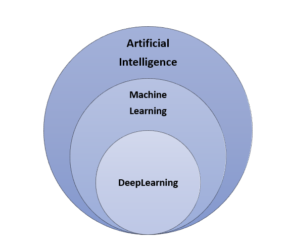
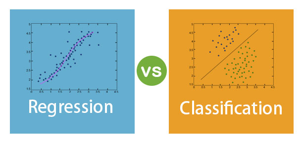
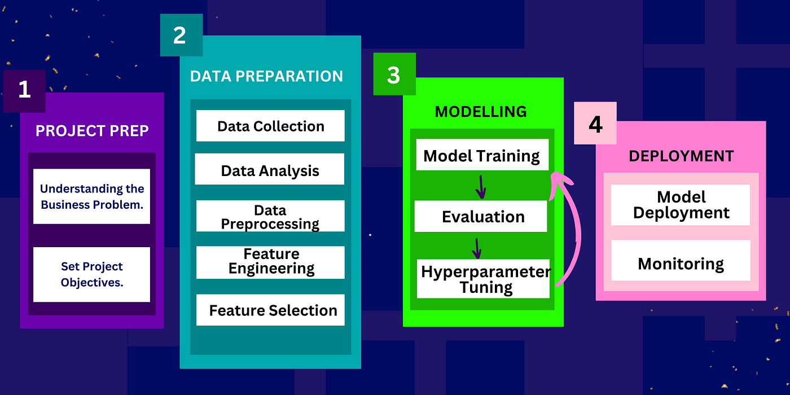

# Introduction to Machine Learning

## 1. What is Machine Learning?
**Definition**:  
Machine Learning adalah cabang dari kecerdasan buatan (AI) yang memungkinkan sistem belajar dari data, mengenali pola, dan membuat keputusan tanpa diprogram secara eksplisit. Hal ini dilakukan dengan menggunakan algoritma yang memungkinkan komputer untuk menemukan pola tersembunyi dalam data yang besar dan kompleks. Algoritma Machine Learning digunakan untuk mengotomatisasi pengambilan keputusan dalam banyak aplikasi modern, dari rekomendasi produk hingga pengenalan suara dan gambar.

### Basic Process:
1. **Data Collection**: Data adalah bahan utama yang diperlukan untuk model Machine Learning. Data ini bisa dalam bentuk angka, teks, gambar, atau suara, tergantung pada jenis aplikasi.
2. **Data Processing and Analysis**: Data yang dikumpulkan harus dibersihkan dan diproses agar siap digunakan. Proses ini sering kali melibatkan normalisasi, penghapusan data yang tidak relevan, dan pengolahan ulang.
3. **Model Building**: Setelah data siap, model Machine Learning dibangun menggunakan algoritma yang dipilih berdasarkan jenis masalah yang dihadapi.
4. **Prediction**: Model yang telah dilatih dapat digunakan untuk memprediksi atau mengklasifikasikan data baru yang belum pernah dilihat oleh model.

### Why is Machine Learning Important?
1. **Increased Efficiency**: Machine Learning memungkinkan otomasi berbagai tugas yang sebelumnya membutuhkan banyak campur tangan manusia, seperti pengenalan pola atau analisis Big Data. Hal ini membantu meningkatkan efisiensi dan mengurangi kesalahan manusia.
2. **Big Data Analysis**: Seiring dengan meningkatnya jumlah data yang dihasilkan oleh sistem digital modern pada setiap harinya, Machine Learning menawarkan cara untuk mengekstrak *insight* yang berharga dari data yang sangat besar (Big Data).
3. **Innovation**: Machine Learning mendukung inovasi teknologi di banyak bidang, termasuk *autonomous vehicle*, analisis genetik, deteksi penipuan, dan banyak lagi.

## 2. Types of Machine Learning

### A. Supervised Learning
**Definition**:  
Dalam Supervised Learning, model dilatih menggunakan data yang telah dilabeli, artinya setiap data input dipasangkan dengan output yang diharapkan. Model ini belajar dari data *training* untuk memprediksi output dari data baru.

**Examples**:
- **Classification**: Memisahkan data ke dalam beberapa kategori. Misalnya, menentukan apakah email adalah spam atau bukan spam.

- **Regression**:  Digunakan untuk memprediksi nilai kontinu, seperti memprediksi harga rumah berdasarkan ukuran dan lokasi.

**Methods**:
- **Linear Regression**: Memodelkan hubungan linear antara variabel input dan output.
- **K-Nearest Neighbors (KNN)**: Mengklasifikasikan titik data baru berdasarkan tetangga terdekat dalam dataset *training*.
- **Decision Trees**: Membuat keputusan berdasarkan serangkaian aturan yang diambil dari fitur dataset.
- **Support Vector Machines (SVM)**: Menemukan *hyperplane* yang paling optimal untuk memisahkan data dalam ruang multidimensi.

### B. Unsupervised Learning
**Definition**:  
Unsupervised learning digunakan ketika data tidak memiliki label atau output yang jelas. Model dilatih untuk menemukan pola tersembunyi dalam data.

**Examples**:
- **Clustering**: Membagi dataset menjadi beberapa kelompok atau cluster berdasarkan kemiripan data. Misalnya, segmentasi pelanggan dalam analisis bisnis.

- **Dimensionality Reduction**: Teknik seperti Principal Component Analysis (PCA) digunakan untuk mengurangi jumlah variabel dalam dataset sambil mempertahankan informasi yang paling penting.

**Methods**:
- **K-Means Clustering**: Mengelompokkan data ke dalam 'K' cluster berdasarkan kedekatan satu sama lain.
- **Hierarchical Clustering**: Membangun hierarki cluster dengan menggabungkan atau memecah cluster yang ada.
- **Association Rules**: Menemukan hubungan atau pola antar item dalam dataset besar (misalnya, "jika pelanggan membeli A, mereka cenderung membeli B").

### C. Semi-Supervised Learning
**Definition**:  
Semi-Supervised Learning menggabungkan data berlabel dan tidak berlabel dalam proses pelatihan. Digunakan ketika pelabelan data memakan waktu atau mahal, tetapi masih bisa memanfaatkan sebagian kecil data berlabel untuk melatih model.

**Example**:  
Semi-supervised learning digunakan dalam pengenalan wajah, di mana hanya sebagian kecil data yang diberi label, tetapi seluruh dataset digunakan untuk melatih model.

### D. Reinforcement Learning
**Definition**:  
Model belajar melalui interaksi dengan lingkungan, memperoleh penghargaan atau hukuman berdasarkan tindakan yang diambil. Metode ini digunakan untuk masalah di mana agen harus belajar dari pengalamannya sendiri.

**Example**:  
Digunakan dalam permainan (seperti **AlphaGo** dari Google) dan robotika untuk membangun sistem yang dapat belajar melakukan tugas dengan baik melalui trial and error.

## 3. Applications of Machine Learning
1. **Healthcare**: Diagnosa penyakit, analisis citra medis, pengembangan obat, dan personalisasi perawatan medis berdasarkan data genomik.
2. **Finance**: Deteksi penipuan, prediksi pasar saham, analisis risiko kredit, dan otomatisasi layanan pelanggan melalui chatbot AI.
3. **E-commerce**: Rekomendasi produk yang dipersonalisasi berdasarkan perilaku pengguna, prediksi permintaan, dan pengoptimalan harga dinamis.
4. **Transportation**: Sistem navigasi cerdas, mobil otonom, pengoptimalan rute untuk pengiriman, dan analisis pola lalu lintas untuk perencanaan infrastruktur.

## 4. Machine Learning Workflow

### A. Data Collection
- **Data Sources**: Data dapat diperoleh dari database internal, API, sensor IoT, atau data publik seperti dataset open source.
- **Data Quality**: Pastikan data yang digunakan berkualitas baik dalam hal akurasi, konsistensi, relevansi, dan tidak ada data yang hilang.

### B. Data Preprocessing
- **Data Cleaning**: Hapus data yang hilang atau tidak relevan, isi missing values, dan hapus outliers yang dapat memengaruhi hasil model.
- **Data Transformation**: Proses normalisasi atau standarisasi data numerik, dan encoding data kategori (misalnya, mengubah kategori teks menjadi angka).

### C. Model Selection
- Algoritma yang dipilih tergantung pada jenis masalah (*classification*, *regression*, *clustering*, dll), serta ukuran dan sifat data.
- **Overfitting**: Terjadi ketika model terlalu kompleks dan menangkap noise dari data latih, sehingga performanya buruk pada data baru.
- **Underfitting**: Terjadi ketika model terlalu sederhana untuk menangkap pola dalam data, sehingga tidak mampu membuat prediksi yang akurat.

### D. Model Training
- Data dibagi menjadi **data latih** (untuk melatih model), **data validasi** (untuk mengatur parameter model), dan **data uji** (untuk menguji performa akhir model).
- Model dilatih dengan mengoptimalkan parameter *(hyperparameter tuning)* untuk mendapatkan performa terbaik.

### E. Model Evaluation
- Gunakan metrik evaluasi yang tepat: **Akurasi** untuk klasifikasi, **MSE (Mean Squared Error)** untuk regresi, serta **Presisi**, **Recall**, dan **F1-score** untuk evaluasi klasifikasi yang lebih rinci.
- Penting untuk mengevaluasi model pada data uji untuk mengukur generalisasi.

## 5. Machine Learning Tools and Platforms

### A. Libraries and Frameworks
- **Scikit-Learn**: Library Python yang menyediakan berbagai algoritma untuk supervised dan unsupervised learning, seperti regresi linier, SVM, dan K-means.
- **TensorFlow and Keras**: Framework yang populer untuk deep learning, memungkinkan pembangunan dan pelatihan neural networks.
- **PyTorch**: Framework lain untuk deep learning, banyak digunakan dalam penelitian karena fleksibilitas dan kemudahan penggunaannya.

### B. Platforms
- **Google Colab**: Lingkungan berbasis cloud gratis yang mendukung Python dan memungkinkan pengguna menjalankan kode langsung dari browser tanpa memerlukan GPU lokal.
- **Jupyter Notebook**: Alat yang memungkinkan eksekusi kode interaktif dan memudahkan eksplorasi data, dokumentasi, serta visualisasi hasil.

## 6. Challenges in Machine Learning

### A. Data Quality and Availability
- Data yang tidak lengkap, bias, atau tidak representatif dapat mengarah pada model yang salah. Misalnya, data yang bias bisa menghasilkan model yang tidak adil dalam keputusan kredit atau rekrutmen.

### B. Model Interpretability
- Model kompleks seperti deep learning sering kali sulit untuk diinterpretasikan, membuatnya sulit untuk mengetahui bagaimana model membuat keputusan.

### C. Overfitting and Generalization
- Overfitting adalah tantangan umum dalam Machine Learning, di mana model terlalu menyesuaikan data latih tetapi gagal untuk menggeneralisasi dengan baik pada data baru. Solusi termasuk regularisasi, cross-validation, dan memperbesar dataset.

## 7. Emerging Trends in Machine Learning

### A. Deep Learning
- *Deep Neural Networks* telah mengubah banyak bidang seperti pengenalan gambar, pemrosesan bahasa alami, dan pengenalan suara. Deep learning berkembang pesat berkat peningkatan daya komputasi dan dataset besar yang tersedia.

### B. Transfer Learning
- Transfer learning memungkinkan model yang telah dilatih untuk satu tugas digunakan kembali untuk tugas baru dengan sedikit penyesuaian, menghemat waktu dan sumber daya.

### C. AutoML (Automated Machine Learning)
- AutoML adalah teknik yang mengotomatiskan proses pemilihan model dan tuning hyperparameter
