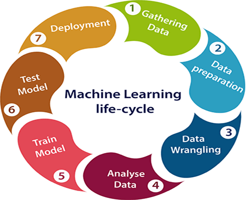

# Machine Learning Life Cycle untuk Membangun Model yang Efektif

Machine Learning telah menjadi salah satu teknologi yang paling revolusioner dalam berbagai industri, memungkinkan kita untuk membuat prediksi dan keputusan otomatis berdasarkan data. Membangun model machine learning yang efektif adalah proses yang kompleks dan melibatkan beberapa tahap penting, mulai dari pemahaman masalah hingga penerapan model ke dunia nyata. Dalam materi ini, kita akan membahas langkah-langkah yang perlu diambil untuk membangun model yang akurat dan dapat diandalkan, serta strategi untuk mengoptimalkan performa dan memastikan hasil yang terbaik.

## 1. Problem and Data Understanding

Tahap pertama dalam siklus hidup machine learning adalah **pemahaman masalah dan data yang dimiliki**. Pada tahap ini, kita akan menentukan tujuan dari proyek dan bagaimana machine learning dapat digunakan untuk memecahkan masalah tersebut.

### Komponen Penting dalam Pemahaman Masalah:
- **Definisi Tujuan**: Identifikasi dan definisikan masalah yang ingin diselesaikan, seperti meningkatkan penjualan, memprediksi *churn* pelanggan, atau mengidentifikasi pola dalam data medis.
  
- **Pemahaman Stakeholder**: Memahami siapa yang akan menggunakan model dan bagaimana mereka akan memanfaatkannya. Misalnya, apakah model digunakan oleh tim pemasaran atau tim operasional?
  
- **Jenis Masalah**: Identifikasi jenis masalah yang akan diselesaikan. Misalnya:
  - **Klasifikasi**: Prediksi kategori atau label (misalnya, apakah email spam atau bukan).
  - **Regresi**: Prediksi nilai kontinu (misalnya, memprediksi harga rumah).
  - **Klasterisasi**: Pengelompokan data tanpa label (misalnya, segmentasi pelanggan).

- **Indikator Keberhasilan**: Tentukan metrik yang relevan untuk mengevaluasi kinerja model, seperti akurasi, precision, recall, atau F1-score untuk klasifikasi, atau mean squared error (MSE) untuk regresi.

---

## 2. Data Understanding

Data adalah bahan baku yang paling penting dalam machine learning. Memahami data yang dimiliki adalah kunci untuk merancang model yang efektif dan menghindari jebakan yang dapat merusak hasil model.

### Langkah-langkah Mendalam:
1. **Analisis Kualitas Data**:
   - Mulailah dengan mengeksplorasi apakah data yang ada memiliki **nilai yang hilang (missing values)**, **duplikasi**, atau **inkonsistensi**.
   - Gunakan teknik statistik dasar untuk memeriksa distribusi data, seperti menggunakan histogram untuk melihat distribusi nilai numerik, atau menggunakan tabel frekuensi untuk kategori.

2. **Pemetaan Variabel**:
   - **Variabel Target**: Tentukan variabel yang ingin Anda prediksi (misalnya, harga rumah, kelas email). Variabel target ini akan menentukan jenis model yang akan dipilih.
   - **Fitur**: Identifikasi fitur atau atribut lain yang bisa mempengaruhi hasil. Misalnya, dalam prediksi harga rumah, fitur yang relevan bisa mencakup luas tanah, lokasi, dan jumlah kamar tidur.
   
3. **Eksplorasi Hubungan antar Fitur**:
   - Gunakan scatter plots atau **matriks korelasi** untuk memvisualisasikan hubungan antar fitur. Hal ini bisa membantu dalam mengidentifikasi fitur yang sangat berkorelasi satu sama lain yang mungkin mengarah pada multikolinearitas dalam model.
   
4. **Distribusi Data**:
   - Pahami bagaimana distribusi data untuk setiap fitur. Apakah data terdistribusi normal atau miring (skewed)? Data yang tidak terdistribusi normal mungkin memerlukan transformasi sebelum digunakan dalam model.

---

## 3. Data Preparation

Setelah masalah dipahami, tahap berikutnya adalah **persiapan data**. Data adalah fondasi utama dalam machine learning, dan kualitas data sangat memengaruhi hasil model.

### Pengumpulan Data:
- **Sumber Data**: Data dapat berasal dari berbagai sumber, seperti data internal (misalnya, database perusahaan), data eksternal (misalnya, API), atau data publik (misalnya, dataset pemerintah).
  
- **Jenis Data**: Data bisa berupa numerik, seperti suhu atau harga, atau kategorikal, seperti jenis kelamin atau status perkawinan. Pemahaman ini akan menentukan cara pengolahan data.

### Pembersihan Data:
- **Menangani Nilai yang Hilang (Missing Values)**: Nilai yang hilang harus ditangani dengan cara imputasi (mengisi dengan nilai rata-rata, modus) atau penghapusan data.
  
- **Mengidentifikasi dan Mengatasi Outliers**: Outlier atau nilai yang jauh berbeda dari data lainnya harus diidentifikasi dan diatasi menggunakan teknik transformasi atau penghapusan.

- **Inkonsistensi Data**: Perbaiki inkonsistensi dalam format atau unit data (misalnya, format tanggal yang tidak seragam atau satuan yang berbeda).

- **Transformasi dan Normalisasi Data**: Data yang memiliki skala yang berbeda-beda mungkin perlu dinormalisasi atau distandarisasi untuk memaksimalkan kinerja model.

---

## 4. Exploratory Data Analysis - EDA

Setelah data dibersihkan, langkah berikutnya adalah **analisis data eksploratif (EDA)**. EDA bertujuan untuk mengeksplorasi data lebih dalam, memahami pola atau hubungan antar fitur, dan mengevaluasi distribusi variabel. Tujuan dari EDA adalah untuk **mengidentifikasi pola** yang bisa digunakan dalam pengembangan model dan **mengevaluasi kualitas data**.

### Tujuan EDA:
- **Mendeteksi Pola dan Tren**: Visualisasi dan statistik deskriptif digunakan untuk mengidentifikasi pola, tren, dan hubungan antar variabel.
  
- **Mendeteksi Outlier dan Anomali**: Menggunakan visualisasi seperti boxplot atau scatter plot untuk mengidentifikasi data yang tidak biasa.
  
- **Memilih Fitur yang Relevan**: EDA membantu kita memilih fitur yang relevan dan mengeliminasi fitur yang tidak bermanfaat atau memiliki banyak nilai yang hilang.

### Metode dan Alat dalam EDA:
- **Visualisasi Data**:
  - **Histogram dan Bar Chart**: Untuk menggambarkan distribusi data numerik atau kategorikal.
  - **Box Plot**: Untuk mengevaluasi distribusi data dan mendeteksi outlier.
  - **Heatmap**: Untuk melihat korelasi antar variabel.
  - **Pair Plot**: Untuk mengidentifikasi hubungan antar fitur.
  
- **Statistik Deskriptif**:
  - **Mean, Median, Mode**: Menggunakan statistik deskriptif untuk menggambarkan data numerik.
  - **Standar Deviasi dan Varians**: Untuk melihat variasi dalam data.
  - **Korelasi**: Mengukur hubungan antara fitur dalam dataset.

---

## 5. Model Selection

Setelah memahami data dan masalah, tahap berikutnya adalah **pemilihan model**. Pemilihan model yang tepat sangat penting untuk mendapatkan hasil yang akurat. Memilih model yang tepat adalah langkah krusial. Model yang dipilih harus sesuai dengan jenis masalah (klasifikasi, regresi, dll) serta karakteristik data yang tersedia.

### Faktor yang Mempengaruhi Pemilihan Model:
- **Jenis Masalah**: Pilih model yang sesuai berdasarkan jenis masalah, seperti klasifikasi, regresi, atau klasterisasi.
  - **Klasifikasi**: Logistic Regression, Decision Trees, Random Forest, SVM.
  - **Regresi**: Linear Regression, Polynomial Regression, XGBoost.
  - **Klasterisasi**: K-Means, DBSCAN, Hierarchical Clustering.
  
- **Ukuran dan Kompleksitas Data**: Untuk dataset besar, model seperti Random Forest atau GBM lebih efektif, sedangkan untuk dataset kecil, model seperti Logistic Regression mungkin lebih cocok.

- **Kebutuhan Interpretabilitas**: Beberapa model, seperti Decision Trees, lebih mudah diinterpretasikan, sementara model seperti Neural Networks cenderung lebih sulit dipahami.

- **Kinerja Model**: Kinerja model diukur menggunakan metrik seperti akurasi untuk klasifikasi atau MSE untuk regresi.

---

## 6. Model Training

Setelah memilih model, tahap berikutnya adalah **pelatihan model**. Pada tahap ini, model yang dipilih akan dilatih menggunakan data pelatihan yang telah disiapkan. Model akan mempelajari pola-pola dari data dan mengoptimalkan parameter untuk meminimalkan kesalahan.

### Proses Pelatihan:
- **Pembagian Data**: Biasanya, data dibagi menjadi dua bagian:
  - **Data Latih (Training Set)**: Digunakan untuk melatih model.
  - **Data Uji (Test Set)**: Digunakan untuk menguji kinerja model.
  
- **Optimasi Hyperparameter**: Banyak model memiliki hyperparameter yang perlu disesuaikan untuk memaksimalkan kinerjanya. Teknik seperti **Grid Search** atau **Random Search** digunakan untuk menemukan set hyperparameter yang optimal. Contoh hyperparameter meliputi, jumlah pohon dalam Random Forest, jumlah kluster dalam K-Means, dan sebagainya.

- **Proses Pembelajaran**: Model dilatih dengan data latih, mempelajari pola dan hubungan dalam data, dan menyesuaikan parameter untuk mencapai performa terbaik.

---

## 7. Model Evaluation

Setelah pelatihan, tahap berikutnya adalah **evaluasi model**. Evaluasi model bertujuan untuk memastikan bahwa model yang telah dilatih dapat menghasilkan prediksi yang akurat dan relevan untuk data yang belum pernah dilihat sebelumnya.

### Pengujian dengan Data yang Tidak Terlihat
- Model dievaluasi menggunakan dataset yang tidak digunakan dalam proses pelatihan. Hal ini penting untuk mengukur kemampuan model dalam generalisasi, yaitu kemampuannya untuk memberikan prediksi yang baik pada data baru.

### Metode Evaluasi:
- **K-Fold Cross-Validation**: Teknik ini membagi data menjadi beberapa bagian dan menggunakan bagian yang berbeda untuk pelatihan dan pengujian yang membantu memastikan model tidak terlalu bergantung pada data tertentu.

- **Metrik Evaluasi**:
  - **Akurasi**: Proporsi prediksi yang benar.
  - **Precision, Recall, dan F1-Score**: Digunakan dalam masalah klasifikasi yang tidak seimbang.
  - **Mean Squared Error (MSE)**: Digunakan dalam masalah regresi untuk menghitung kesalahan antara prediksi dan nilai aktual.
  - **R-squared**: Mengukur seberapa baik model dapat menjelaskan variasi dalam data.

### Memilih Model Terbaik
Dalam banyak kasus, kita mungkin mengembangkan beberapa model untuk fenomena tertentu. Proses evaluasi membantu dalam memilih model terbaik berdasarkan kinerja yang diukur dan kesesuaian terhadap kebutuhan bisnis.

---

## 8. Model Deployment

Setelah model terbukti efektif dan memberikan hasil yang memuaskan, tahap selanjutnya adalah **deploying** model ke lingkungan produksi. Deployment adalah langkah terakhir di mana model yang telah dilatih dan dievaluasi disiapkan untuk digunakan dalam dunia nyata oleh sistem atau pengguna.

### Strategi Penerapan:

#### **1. Tujuan Penerapan Model**
- **Mengintegrasikan Model ke dalam Sistem**: Tujuan utama dari penerapan model adalah untuk mengintegrasikan model ke dalam sistem yang sudah ada, sehingga dapat mulai digunakan untuk membuat prediksi dan memberikan insight bisnis secara real-time.
- **Menawarkan Solusi yang Berguna**: Dengan menerapkan model, organisasi dapat memanfaatkan hasil analisis data untuk pengambilan keputusan yang lebih baik, meningkatkan efisiensi operasional, dan mendapatkan keuntungan kompetitif.

#### **2. Memilih Struktur dan Saluran Penerapan**

- Model dapat diterapkan dalam berbagai format dan saluran, tergantung pada kebutuhan bisnis dan infrastruktur yang ada. Beberapa opsi penerapan termasuk:
  - **Aplikasi Web**: Mengintegrasikan model ke dalam aplikasi berbasis web yang dapat diakses oleh pengguna.
  - **API (Application Programming Interface)**: Menyediakan model sebagai layanan melalui API, memungkinkan sistem lain untuk mengakses dan menggunakan model untuk prediksi.
  - **Aplikasi Mobile**: Mengimplementasikan model dalam aplikasi mobile untuk memberikan pengalaman pengguna yang lebih baik.
  - 
#### **3. Monitoring dan Pemeliharaan**
- Setelah model diterapkan, penting untuk memantau kinerjanya secara terus-menerus. Monitoring ini bertujuan untuk memastikan bahwa model tetap berkinerja baik di dunia nyata dan mampu memberikan hasil yang akurat.
- Jika terjadi penurunan kinerja, langkah-langkah pemeliharaan harus dilakukan, seperti:
  - Melakukan retraining model dengan data baru.
  - Menyesuaikan model jika terdapat perubahan dalam pola data atau kebutuhan bisn