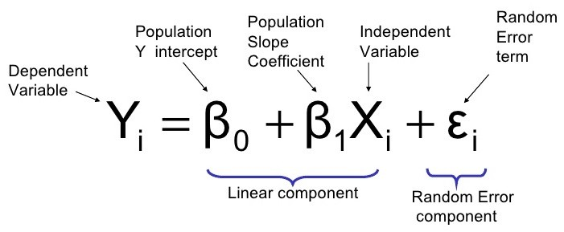
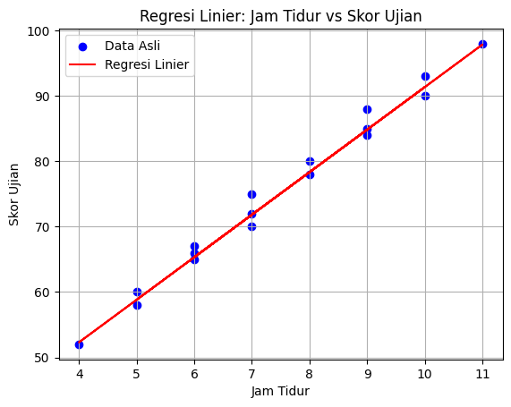
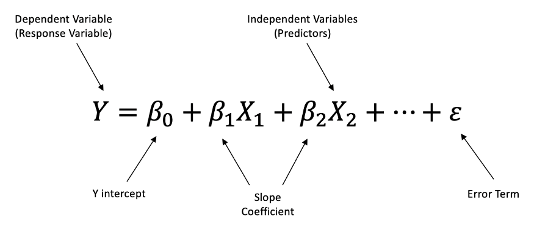
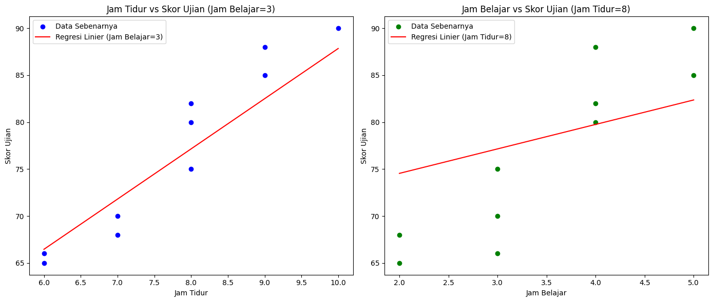
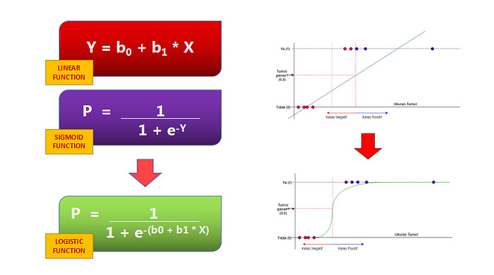
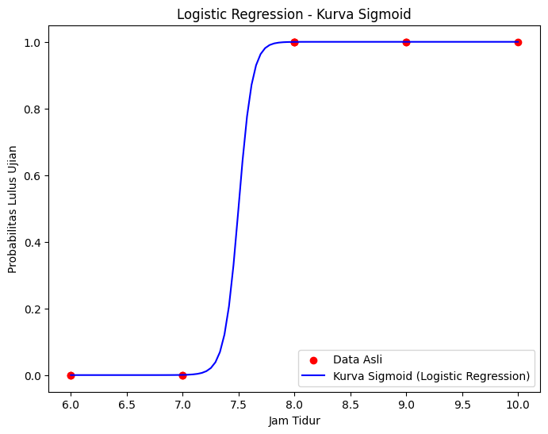

# Regression dalam Machine Learning

## Apa itu Regression?
**Regresi** adalah teknik dalam statistik dan machine learning yang digunakan untuk memodelkan hubungan antara satu atau lebih variabel independen (fitur) dan variabel dependen (target). Pada dasarnya, regresi mencoba untuk menemukan pola atau hubungan yang dapat digunakan untuk memprediksi nilai variabel dependen berdasarkan informasi yang tersedia pada variabel independen.  Tujuan utama regresi adalah untuk menghasilkan model yang mampu memprediksi nilai kontinu dari target, seperti harga, suhu, atau skor, berdasarkan input yang diberikan.

Regresi dapat digunakan dalam berbagai aplikasi, mulai dari ekonomi dan keuangan, hingga ilmu sosial dan teknik. Beberapa jenis regresi yang umum digunakan dalam machine learning termasuk **Linear Regression** dan **Logistic Regression**. Regresi linier, misalnya, mengasumsikan hubungan linear antara fitur dan target, di mana perubahan kecil pada fitur akan menghasilkan perubahan proporsional pada target. Regresi logistik, meskipun namanya mengandung kata "regresi", digunakan untuk masalah klasifikasi dengan target biner, seperti memprediksi apakah pelanggan akan membeli produk atau tidak. Setiap jenis regresi memiliki metode dan asumsi tertentu yang mempengaruhi bagaimana model dibangun dan seberapa akurat prediksi yang dihasilkan.

---

## Tipe - Tipe Algoritma Regresi

### 1. Simple Linear Regression
**Simple Linear Regression** adalah metode statistika yang digunakan untuk memodelkan hubungan linier antara variabel independen (X) dan variabel dependen (Y). Tujuan utama adalah untuk memprediksi nilai Y berdasarkan nilai X. Metode ini merupakan teknik prediksi yang mengasumsikan bahwa terdapat hubungan linear antara variabel independen (input) dan variabel dependen (output). Dalam kasus regresi linier sederhana, model ini mencoba untuk menyesuaikan garis lurus terbaik yang dapat memprediksi nilai output berdasarkan input.

**Rumus Regresi Linier Sederhana**
Pada Regresi Linier Sederhana, hubungan antara variabel independen X dan dependen Y dapat dijelaskan dengan rumus:



**Tujuan Model**
Tujuan utama dari regresi linier adalah untuk menemukan nilai-nilai `β0` dan `β1` yang menghasilkan model terbaik, yaitu model yang dapat memprediksi `Y` seakurat mungkin berdasarkan `X`. Salah satu cara untuk mencari nilai-nilai koefisien ini adalah dengan menggunakan metode Least Squares, yang meminimalkan jumlah kuadrat selisih antara nilai yang diprediksi dan nilai observasi (residual).

**Evaluasi Model Regresi Linier**
Dalam evaluasi model regresi linier sederhana, terdapat beberapa metrik utama untuk mengukur kinerja model, yaitu
 - **Mean Squared Error (MSE)**: Menghitung rata-rata kuadrat dari selisih antara nilai prediksi dan nilai aktual. MSE sensitif terhadap outlier karena kesalahan dikuadratkan. Nilai MSE yang lebih kecil menunjukkan model yang lebih baik.
 - **Root Mean Squared Error (RMSE)**: Merupakan akar dari MSE, yang memberikan kesalahan rata-rata dalam satuan yang sama dengan data asli. RMSE lebih mudah diinterpretasikan dibandingkan MSE dan juga sensitif terhadap outlier.
 - **Mean Absolute Error (MAE)**: Menghitung rata-rata nilai absolut dari selisih antara prediksi dan nilai aktual. MAE tidak memperbesar dampak outlier seperti MSE, sehingga lebih robust terhadap data yang memiliki distribusi kesalahan yang tidak normal.
 - **R-squared (R²)**: Mengukur proporsi variasi data yang dapat dijelaskan oleh model, dengan nilai antara 0 (tidak menjelaskan variasi sama sekali) hingga 1 (menjelaskan seluruh variasi). R² sering digunakan untuk menilai kekuatan model.

**Implementasi Simple Linear Regression dalam Kode Python** 
```python
# Import library yang dibutuhkan
import numpy as np
import pandas as pd
import matplotlib.pyplot as plt
from sklearn.model_selection import train_test_split
from sklearn.linear_model import LinearRegression
from sklearn.metrics import mean_squared_error, r2_score

# Membuat dataset sederhana
data = {
    'Jam Tidur': [7, 9, 6, 10, 8, 4, 5, 11, 8, 7, 6, 9, 10, 5, 7, 6, 9],                 # Variabel Independen (X)
    'Skor Ujian': [75, 88, 65, 93, 80, 52, 60, 98, 78, 70, 66, 85, 90, 58, 72, 67, 84]   # Variabel Dependen (Y)
}

# Membuat DataFrame dari dataset
df = pd.DataFrame(data)

# Menentukan variabel input dan output
X = df[['Jam Tidur']]  # Jam Tidur sebagai input (X)
y = df['Skor Ujian']   # Skor Ujian sebagai output (y)

# Membagi data menjadi data latih dan data uji (80% latih, 20% uji)
X_train, X_test, y_train, y_test = train_test_split(X, y, test_size=0.2, random_state=42)

# Membuat model regresi linier
model = LinearRegression()

# Melatih model dengan data latih
model.fit(X_train, y_train)

# Membuat prediksi untuk data uji
y_pred = model.predict(X_test)

# Visualisasi hasil regresi linier
plt.scatter(X, y, color='blue', label='Data Asli')   # Titik data asli
plt.plot(X, model.predict(X), color='red', label='Regresi Linier')  # Garis regresi linier
plt.title('Regresi Linier: Jam Tidur vs Skor Ujian')
plt.xlabel('Jam Tidur')
plt.ylabel('Skor Ujian')
plt.legend()
plt.grid(True)
plt.show()

# Evaluasi model menggunakan metrik
mse = mean_squared_error(y_test, y_pred)  # Mean Squared Error
rmse = np.sqrt(mse)  # Root Mean Squared Error
mae = np.mean(np.abs(y_test - y_pred))  # Mean Absolute Error
r2 = r2_score(y_test, y_pred)  # R-squared

# Output hasil evaluasi model
print(f"Mean Squared Error (MSE): {mse}")
print(f"Root Mean Squared Error (RMSE): {rmse}")
print(f"Mean Absolute Error (MAE): {mae}")
print(f"R-squared: {r2}")

# Output koefisien dan intercept model
print(f"Koefisien (Slope): {model.coef_[0]}")
print(f"Intercept: {model.intercept_}")

# Prediksi untuk beberapa data baru
new_data = np.array([[5], [8], [12]])  # Jam tidur baru yang ingin diprediksi
predictions = model.predict(new_data)  # Prediksi skor ujian untuk data baru

# Output prediksi
for hours, prediction in zip(new_data.flatten(), predictions):
    print(f"Prediksi skor ujian untuk {hours} jam tidur: {prediction:.2f}")
```

Kode di atas menghasilkan grafik hasil garis yang terbentuk sebagai berikut:


---

### 2. Multiple Linear Regression
**Multiple Linear Regression** memperluas konsep regresi linier sederhana dengan melibatkan lebih dari satu variabel independen (fitur) untuk memprediksi satu variabel dependen (target). Dalam regresi linier sederhana, hubungan antara variabel dependen dan independen digambarkan oleh garis lurus, sedangkan pada regresi linier berganda, hubungan tersebut digambarkan oleh sebuah hiperplane dalam ruang multivariat. Model ini berusaha untuk memprediksi nilai variabel dependen dengan menggabungkan informasi dari beberapa fitur sekaligus.

**Rumus Multiple Linear Regression**
Pada Multiple Linear Regression, hubungan antara variabel independen X dan dependen Y dapat dijelaskan dengan rumus:



**Tujuan Model**
Tujuan utama dari Multiple Linear Regression adalah untuk menemukan nilai-nilai koefisien regresi `β0`, `β1`, `β2`,...,`βn` yang menghasilkan model terbaik, yaitu model yang dapat memprediksi nilai variabel dependen Y seakurat mungkin berdasarkan kombinasi variabel independen `X1`, `X2`,...,`Xn`. Salah satu cara untuk mencari nilai-nilai koefisien ini adalah dengan menggunakan metode Least Squares, yang meminimalkan jumlah kuadrat selisih antara nilai yang diprediksi dan nilai observasi (residual) untuk seluruh data.

**Simple Linear Regression vs. Multiple Linear Regression**
- Regresi Linier Sederhana (Simple Linear Regression): Hanya melibatkan satu variabel independen `X` untuk memprediksi `Y`.
- Regresi Linier Berganda (Multiple Linear Regression): Melibatkan lebih dari satu variabel independen `X1`, `X2`, `X3`,..., `Xn` untuk memprediksi `Y`.

**Evaluasi Model Multiple Linear Regression**
Dalam evaluasi model Multiple Linear Regression, terdapat beberapa metrik utama untuk mengukur kinerja model, yaitu:
- **Mean Squared Error (MSE)**: Menghitung rata-rata kuadrat dari selisih antara nilai prediksi dan nilai aktual. MSE sensitif terhadap outlier karena kesalahan dikuadratkan. Nilai MSE yang lebih kecil menunjukkan model yang lebih baik.
- **Root Mean Squared Error (RMSE)**: Merupakan akar dari MSE, yang memberikan kesalahan rata-rata dalam satuan yang sama dengan data asli. RMSE lebih mudah diinterpretasikan dibandingkan MSE dan juga sensitif terhadap outlier.
- **Mean Absolute Error (MAE)**: Menghitung rata-rata nilai absolut dari selisih antara prediksi dan nilai aktual. MAE tidak memperbesar dampak outlier seperti MSE, sehingga lebih robust terhadap data yang memiliki distribusi kesalahan yang tidak normal.
- **R-squared (R²)**: Mengukur proporsi variasi data yang dapat dijelaskan oleh model, dengan nilai antara 0 (tidak menjelaskan variasi sama sekali) hingga 1 (menjelaskan seluruh variasi). R² sering digunakan untuk menilai seberapa baik model dapat menjelaskan hubungan antara variabel independen dan dependen.
- **Adjusted R-squared**: Merupakan versi yang telah disesuaikan dari R², yang mengoreksi pengaruh jumlah variabel independen dalam model. Adjusted R² berguna untuk membandingkan model dengan jumlah fitur yang berbeda, karena penalti diberikan untuk fitur yang tidak memberikan kontribusi signifikan terhadap model.

**Implementasi Multiple Linear Regression dalam Kode Python**
```python
# Import library yang digunakan
import numpy as np
import pandas as pd
import matplotlib.pyplot as plt
from sklearn.model_selection import train_test_split
from sklearn.linear_model import LinearRegression
from sklearn.metrics import mean_squared_error, r2_score

# Membuat dataset sederhana
data = {
    'Jam Tidur': [6, 7, 8, 9, 7, 6, 8, 9, 10, 8],
    'Jam Belajar': [2, 3, 4, 5, 2, 3, 3, 4, 5, 4],
    'Skor Ujian': [65, 70, 80, 85, 68, 66, 75, 88, 90, 82]
}

# Membuat DataFrame dari dataset
df = pd.DataFrame(data)

# Menentukan variabel input (independent) dan output (dependent)
X = df[['Jam Tidur', 'Jam Belajar']]  # Variabel independen (fitur)
y = df['Skor Ujian']  # Variabel dependen (target)

# Membagi data menjadi data latih dan data uji
X_train, X_test, y_train, y_test = train_test_split(X, y, test_size=0.2, random_state=42)

# Membuat model regresi linier
model = LinearRegression()

# Melatih model dengan data latih
model.fit(X_train, y_train)

# Melakukan prediksi pada data uji
y_pred = model.predict(X_test)

# Evaluasi model
mse = mean_squared_error(y_test, y_pred)  # Mean Squared Error
rmse = np.sqrt(mse)   # Root Mean Squared Error
r2 = r2_score(y_test, y_pred)  # R-squared

# Output hasil evaluasi
print("Mean Squared Error (MSE):", mse)
print("Root Mean Squared Error (RMSE):", rmse)
print("R-squared (R²):", r2)

# Output koefisien dan intercept model
print("Koefisien Regresi (Slope):", model.coef_)
print("Intercept:", model.intercept_)

# Membuat prediksi untuk data baru
new_data = np.array([[7, 3], [8, 4], [10, 5]])  # Contoh data baru
predicted_scores = model.predict(new_data)
print("Prediksi Skor untuk Data Baru:", predicted_scores)

# Grafik 1: Jam Tidur vs Skor Ujian dengan Jam Belajar konstan
plt.figure(figsize=(14, 6))

plt.subplot(1, 2, 1)
# Menampilkan data asli
plt.scatter(df['Jam Tidur'], df['Skor Ujian'], color='blue', label='Data Sebenarnya')

# Menghitung prediksi untuk Jam Tidur dengan Jam Belajar konstan (misalnya 3 jam)
jam_belajar_konstan = 3
prediksi_dengan_jam_tidur = model.predict(np.array([[x, jam_belajar_konstan] for x in np.linspace(6, 10, 100)]))
plt.plot(np.linspace(6, 10, 100), prediksi_dengan_jam_tidur, color='red', label='Regresi Linier (Jam Belajar=3)')

plt.title('Jam Tidur vs Skor Ujian (Jam Belajar=3)')
plt.xlabel('Jam Tidur')
plt.ylabel('Skor Ujian')
plt.legend()

# Grafik 2: Jam Belajar vs Skor Ujian dengan Jam Tidur konstan
plt.subplot(1, 2, 2)
# Menampilkan data asli
plt.scatter(df['Jam Belajar'], df['Skor Ujian'], color='green', label='Data Sebenarnya')

# Menghitung prediksi untuk Jam Belajar dengan Jam Tidur konstan (misalnya 8 jam)
jam_tidur_konstan = 8
prediksi_dengan_jam_belajar = model.predict(np.array([[jam_tidur_konstan, x] for x in np.linspace(2, 5, 100)]))
plt.plot(np.linspace(2, 5, 100), prediksi_dengan_jam_belajar, color='red', label='Regresi Linier (Jam Tidur=8)')

plt.title('Jam Belajar vs Skor Ujian (Jam Tidur=8)')
plt.xlabel('Jam Belajar')
plt.ylabel('Skor Ujian')
plt.legend()

plt.tight_layout()
plt.show()
```

Kode di atas menghasilkan grafik hasil garis yang terbentuk sebagai berikut:


---

### 3. Logistic Regression
**Logistic Regression** adalah teknik statistik yang digunakan untuk memodelkan hubungan antara satu atau lebih variabel independen dengan variabel dependen biner (kategorikal dengan dua kategori, seperti 0 dan 1). Meskipun namanya mengandung kata "regresi", Logistic Regression digunakan untuk masalah klasifikasi, bukan untuk prediksi angka kontinu seperti regresi linier. Tujuan utama dari logistic regression adalah untuk memprediksi probabilitas suatu kejadian yang terjadi dan hasilnya akan berupa nilai antara 0 dan 1 yang kemudian dapat dipetakan ke kategori tertentu (misalnya, kelas Yes atau No).

**Rumus Logistic Regression**
Hubungan antara variabel independen X dan variabel dependen Y pada Logistic Regression dijelaskan melalui fungsi logit (log-odds). Fungsi logit merupakan fungsi dari probabilitas yang dikaitkan dengan fungsi sigmoid:



**Tujuan Model**
Tujuan utama dari Logistic Regression adalah untuk mencari koefisien-koefisien regresi `β0`, `β1`, `β2`,...,`βn` yang dapat memprediksi probabilitas suatu kejadian yang diwakili oleh variabel dependen (biasanya variabel kategorikal 0 atau 1). Model ini menggunakan Maximum Likelihood Estimation (MLE) untuk menemukan parameter yang paling sesuai dengan data.

**Simple Logistic Regression vs. Multiple Logistic Regression**
- Simple Logistic Regression: Melibatkan satu variabel independen `X` untuk memprediksi probabilitas `Y` (kelas 0 atau 1).
- Multiple Logistic Regression: Melibatkan lebih dari satu variabel independen `X1`, `X2`, `X3`,..., `Xn` untuk memprediksi probabilitas `Y`.

**Evaluasi Model Logistic Regression**
Seperti pada regresi linier, evaluasi model regresi logistik melibatkan beberapa metrik untuk menilai kinerja model dalam klasifikasi biner:
- **Accuracy**: Persentase prediksi yang benar dibandingkan dengan total prediksi.
- **Confusion Matrix**: Matriks yang menunjukkan jumlah true positives (TP), true negatives (TN), false positives (FP), dan false negatives (FN) untuk menilai kinerja model secara detail.
- **Precision**: Proporsi prediksi positif yang benar dari seluruh prediksi positif yang dibuat.
Recall (Sensitivity): Proporsi prediksi positif yang benar dari seluruh kejadian positif yang sebenarnya.
- **F1-Score**: Harmonik dari precision dan recall, memberikan satu metrik untuk menilai kinerja model dalam kasus yang tidak seimbang.
- **ROC-AUC (Receiver Operating Characteristic - Area Under Curve)**: Kurva yang menggambarkan trade-off antara true positive rate dan false positive rate. AUC memberikan nilai antara 0 hingga 1, di mana nilai lebih dekat ke 1 menunjukkan model yang lebih baik.

**Implementasi Logistic Regression dalam Kode Python**
```python
# Import library yang dibutuhkan
import numpy as np
import pandas as pd
import matplotlib.pyplot as plt
from sklearn.model_selection import train_test_split
from sklearn.linear_model import LogisticRegression
from sklearn.preprocessing import PolynomialFeatures
from sklearn.metrics import accuracy_score, precision_score, recall_score, f1_score, roc_auc_score, confusion_matrix

# Membuat dataset sederhana
data = {
    'Jam Tidur': [6, 7, 8, 9, 7, 6, 8, 9, 10, 8],
    'Lulus Ujian': [0, 0, 1, 1, 0, 0, 1, 1, 1, 1]  # 0 = Gagal, 1 = Lulus
}

# Membuat DataFrame dari dataset
df = pd.DataFrame(data)

# Menentukan variabel input (independent) dan output (dependent)
X = df[['Jam Tidur']]  # Variabel independen (fitur)
y = df['Lulus Ujian']  # Variabel dependen (target)

# Membagi data menjadi data latih dan data uji
X_train, X_test, y_train, y_test = train_test_split(X, y, test_size=0.2, random_state=42)

# Fitting dengan Polynomial Regression (derajat 3)
poly = PolynomialFeatures(degree=3)  # Menggunakan polinomial derajat 3
X_poly_train = poly.fit_transform(X_train)
X_poly_test = poly.transform(X_test)

# Membuat model Logistic Regression
model = LogisticRegression()

# Melatih model pada data polinomial
model.fit(X_poly_train, y_train)

# Membuat prediksi pada data uji
y_pred = model.predict(X_poly_test)
y_pred_prob = model.predict_proba(X_poly_test)[:, 1]

# Menghitung metrik evaluasi
accuracy = accuracy_score(y_test, y_pred)
precision = precision_score(y_test, y_pred)
recall = recall_score(y_test, y_pred)
f1 = f1_score(y_test, y_pred)
roc_auc = roc_auc_score(y_test, y_pred_prob)
conf_matrix = confusion_matrix(y_test, y_pred)

# Menampilkan metrik evaluasi
print(f"Akurasi: {accuracy:.2f}")
print(f"Precision: {precision:.2f}")
print(f"Recall: {recall:.2f}")
print(f"F1-Score: {f1:.2f}")
print(f"ROC-AUC: {roc_auc:.2f}")
print("Matriks Kebingungannya:")
print(conf_matrix)

# Membuat prediksi pada rentang data yang lebih rapat untuk visualisasi
X_range = np.linspace(X['Jam Tidur'].min(), X['Jam Tidur'].max(), 100).reshape(-1, 1)
X_range_poly = poly.transform(X_range)
y_range_pred_prob = model.predict_proba(X_range_poly)[:, 1]  # Probabilitas pada rentang data

# Plotting hasil
plt.figure(figsize=(8, 6))
plt.scatter(X, y, color='red', label='Data Asli')
plt.plot(X_range, y_range_pred_prob, color='blue', label='Kurva Sigmoid (Logistic Regression)')
plt.title('Logistic Regression - Kurva Sigmoid')
plt.xlabel('Jam Tidur')
plt.ylabel('Probabilitas Lulus Ujian')
plt.legend(loc='lower right')
plt.show()
```
Kode di atas menghasilkan grafik hasil garis yang terbentuk sebagai berikut:


