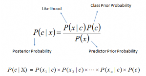
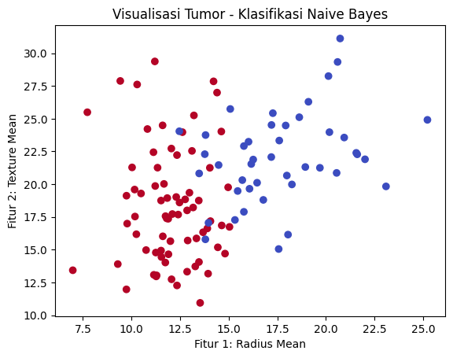
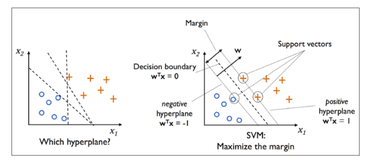
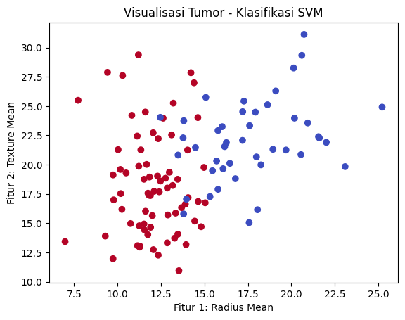

# Classification dalam Machine Learning

## Apa itu Classification?
**Klasifikasi** adalah salah satu teknik dalam machine learning yang digunakan untuk memprediksi kategori atau kelas dari data input. Pada dasarnya, masalah klasifikasi berfokus pada pengelompokan data ke dalam kategori yang sudah ditentukan sebelumnya berdasarkan fitur-fitur yang dimilikinya. Sebagai contoh, dalam masalah klasifikasi email, model akan memprediksi apakah sebuah email termasuk dalam kategori "spam" atau "bukan spam". Klasifikasi digunakan dalam berbagai aplikasi, mulai dari deteksi penipuan, analisis sentimen, hingga diagnosa medis. Algoritma klasifikasi bekerja dengan belajar dari data yang sudah dilabeli (dikenal juga sebagai supervised learning), di mana model dilatih untuk mengidentifikasi pola antara fitur dan kelas dari data tersebut, sehingga bisa digunakan untuk memprediksi kelas pada data yang belum dilabeli.

Beberapa algoritma klasifikasi yang sering digunakan dalam machine learning adalah **Logistic Regression**, **K-Nearest Neighbors (KNN)**, **Support Vector Machine (SVM)**, **Naive Bayes**, **Decision Trees**, dan **Random Forests**.

---

## Tipe-Tipe Algoritma Classification

### 1. K-Nearest Neighbors (KNN)
**K-Nearest Neighbors (KNN)** adalah algoritma klasifikasi yang sederhana dan intuitif dengan mengklasifikasikan data baru berdasarkan kedekatannya dengan data yang sudah dilabeli. KNN tidak membangun model secara eksplisit, tetapi lebih mengandalkan data latih untuk melakukan prediksi dengan menghitung jarak antara data baru dengan data latih yang sudah ada.

**Prinsip Kerja KNN**
- Tentukan nilai K, yaitu jumlah tetangga terdekat yang akan digunakan untuk menentukan kelas data.
- Hitung jarak antara data yang ingin diprediksi dengan seluruh data latih menggunakan metrik jarak, seperti Euclidean distance.
- Ambil K tetangga terdekat dan tentukan kelas mayoritas dari tetangga tersebut. Data akan dikategorikan sesuai dengan kelas mayoritas.

**Formula Jarak**
Pada KNN, untuk menghitung jarak antara dua titik `P = (p1, p2, ..., pn)` dan `Q = (q1, q2, ..., qn)` dalam ruang n-dimensional, kita dapat menggunakan beberapa rumus berikut:


**Keunggulan KNN**
- Mudah dimengerti dan diimplementasikan, sangat intuitif dengan konsep yang sederhana.
- Tidak memerlukan proses pelatihan yang rumit, karena KNN adalah algoritma lazy learning yang hanya menyimpan data dan melakukan prediksi saat dibutuhkan.
- Fleksibel, dapat digunakan untuk tugas klasifikasi dan regresi, serta menangani data multikelas.
- Tidak bergantung pada asumsi distribusi data, membuatnya efektif untuk berbagai jenis dataset tanpa memerlukan pra-penyaringan fitur.
- Dapat menangani data non-linear, efektif dalam memodelkan hubungan yang kompleks antara fitur dan target.

**Kelemahan KNN**
- KNN melakukan perhitungan jarak untuk setiap prediksi, sehingga bisa sangat lambat, terutama pada dataset besar.
- Algoritma ini mengandalkan jarak antara titik data. Oleh karena itu, data yang mengandung outliers dapat mempengaruhi hasil prediksi.
- KNN tidak melakukan pelatihan terpisah, sehingga harus menyimpan seluruh data pelatihan dalam memori. Ini bisa menjadi masalah untuk dataset besar.
- Dalam beberapa kasus, KNN dapat mengalami masalah ketika jumlah fitur sangat banyak (high-dimensional data) karena curse of dimensionality dapat membuat pengukuran jarak menjadi kurang efektif.
- Pemilihan nilai K yang tidak tepat dapat mempengaruhi performa model. Nilai K yang terlalu kecil dapat menyebabkan overfitting, sedangkan nilai K yang terlalu besar bisa menyebabkan underfitting.

**Evaluasi Model KNN**
Dalam evaluasi model KNN, beberapa metrik yang dapat digunakan adalah:
- **Accuracy**: Proporsi prediksi yang benar dibandingkan dengan total prediksi yang dibuat.
- **Precision**: Rasio prediksi positif yang benar terhadap total prediksi positif.
- **Recall**: Rasio prediksi positif yang benar terhadap total data positif yang sebenarnya.
- **F1-Score**: Rata-rata harmonis antara Precision dan Recall.

**Implementasi K-Nearest Neighbors dalam Kode Python** 
```python
# Import library yang dibutuhkan
import numpy as np
import pandas as pd
from sklearn.datasets import load_breast_cancer
from sklearn.model_selection import train_test_split
from sklearn.neighbors import KNeighborsClassifier
from sklearn.metrics import accuracy_score, classification_report
import matplotlib.pyplot as plt

# Memuat dataset breast cancer
data = load_breast_cancer()
X = data.data  # Fitur
y = data.target  # Target (0: Malignant, 1: Benign)

# Membagi data menjadi data latih (80%) dan data uji (20%)
X_train, X_test, y_train, y_test = train_test_split(X, y, test_size=0.2, random_state=42)

# Membuat model KNN dengan K=5
model = KNeighborsClassifier(n_neighbors=5)

# Melatih model dengan data latih
model.fit(X_train, y_train)

# Membuat prediksi untuk data uji
y_pred = model.predict(X_test)

# Evaluasi model menggunakan akurasi
accuracy = accuracy_score(y_test, y_pred)

# Output hasil evaluasi model
print(f"Akurasi Model KNN: {accuracy:.2f}")
print("Laporan Klasifikasi:")
print(classification_report(y_test, y_pred))

# Visualisasi data pertama dan kedua dari fitur sebagai contoh
plt.scatter(X_test[:, 0], X_test[:, 1], c=y_test, cmap='coolwarm', marker='o')
plt.title('Visualisasi Tumor - Klasifikasi KNN')
plt.xlabel('Fitur 1: Radius Mean')
plt.ylabel('Fitur 2: Texture Mean')
plt.show()
```

Kode di atas menghasilkan akurasi sebesar 96% dan grafik hasil klasifikasi yang terbentuk sebagai berikut:


---

### 2. Naive Bayes
**Naive Bayes** adalah algoritma klasifikasi probabilistik yang berdasarkan pada penerapan teorema Bayes dengan asumsi "naive" bahwa setiap fitur independen terhadap fitur lainnya. Meskipun asumsi ini jarang berlaku di dunia nyata, Naive Bayes seringkali memberikan hasil yang baik dan cepat, terutama dalam masalah klasifikasi teks seperti pemfilteran spam dan analisis sentimen.

**Prinsip Kerja Naive Bayes**
Naive Bayes mengklasifikasikan data berdasarkan probabilitas terjadinya suatu kelas (y) berdasarkan fitur-fitur (X). Teorema Bayes digunakan untuk menghitung probabilitas posterior, yang diberikan oleh rumus:



**Jenis-Jenis Naive Bayes**
- **Gaussian Naive Bayes**: Digunakan ketika fitur input berdistribusi normal (Gaussian).
- **Multinomial Naive Bayes**: Digunakan untuk fitur yang memiliki nilai diskrit atau yang terjadi dalam jumlah tertentu (misalnya, jumlah kata dalam teks).
- **Bernoulli Naive Bayes**: Digunakan ketika fitur merupakan variabel biner (misalnya, apakah kata tertentu muncul dalam dokumen atau tidak).

**Keunggulan Naive Bayes**:
- Naive Bayes adalah algoritma yang sangat sederhana dan cepat untuk dipelajari serta diimplementasikan. Dengan membutuhkan sedikit komputasi, algoritma ini sangat efisien untuk dataset besar.
- Naive Bayes sangat efisien pada data besar dengan banyak fitur karena hanya mengandalkan asumsi independensi antar fitur.
- Algoritma ini sangat populer dalam klasifikasi teks, terutama dalam masalah, seperti pemfilteran spam atau analisis sentimen karena mudah menangani kata-kata yang tidak berurutan atau frekuensi kata.
- Dalam beberapa kasus, Naive Bayes sangat kuat terhadap overfitting, terutama pada dataset kecil karena menggunakan probabilitas bersyarat dan menghindari pembelajaran model yang terlalu rumit.
- Dengan kebutuhan komputasi yang rendah, Naive Bayes seringkali dapat diterapkan dengan cepat dan memberikan hasil yang baik dalam banyak kasus.

**Kelemahan Naive Bayes**
- Naive Bayes mengasumsikan bahwa semua fitur bersifat independen yang seringkali tidak realistis. Jika fitur-fitur tersebut saling bergantung, maka performa model bisa menurun.
- Algoritma ini bukanlah pilihan yang baik untuk data yang memiliki hubungan non-linier yang kuat antara fitur-fitur.
- Naive Bayes dapat menjadi sangat sensitif terhadap data yang tidak seimbang (misalnya, lebih banyak kelas negatif daripada kelas positif) karena probabilitas bersyarat cenderung tidak mewakili kelas minoritas dengan benar.
- Meskipun dapat bekerja dengan data kontinu, Naive Bayes lebih cocok untuk data kategorikal dan terkadang memerlukan teknik tambahan (seperti discretization) untuk menangani data kontinu.
- Jika dataset terlalu kecil, model Naive Bayes bisa mengalami kesulitan dalam membangun estimasi probabilitas yang akurat dengan mengarah pada kesalahan klasifikasi.

**Evaluasi Model Naive Bayes**
Dalam evaluasi model Naive Bayes, beberapa metrik yang dapat digunakan adalah:
- **Accuracy**: Proporsi prediksi yang benar dibandingkan dengan total prediksi yang dibuat.
- **Precision**: Rasio prediksi positif yang benar terhadap total prediksi positif.
- **Recall**: Rasio prediksi positif yang benar terhadap total data positif yang sebenarnya.
- **F1-Score**: Rata-rata harmonis antara Precision dan Recall.

**Implementasi Naive Bayes dalam Kode Python**
```python
# Import library yang dibutuhkan
import numpy as np
import pandas as pd
from sklearn.datasets import load_breast_cancer
from sklearn.model_selection import train_test_split
from sklearn.naive_bayes import GaussianNB
from sklearn.metrics import accuracy_score, classification_report
import matplotlib.pyplot as plt

# Memuat dataset breast cancer
data = load_breast_cancer()
X = data.data  # Fitur
y = data.target  # Target (0: Malignant, 1: Benign)

# Membagi data menjadi data latih (80%) dan data uji (20%)
X_train, X_test, y_train, y_test = train_test_split(X, y, test_size=0.2, random_state=42)

# Membuat model Naive Bayes
model = GaussianNB()

# Melatih model dengan data latih
model.fit(X_train, y_train)

# Membuat prediksi untuk data uji
y_pred = model.predict(X_test)

# Evaluasi model menggunakan akurasi
accuracy = accuracy_score(y_test, y_pred)

# Output hasil evaluasi model
print(f"Akurasi Model Naive Bayes: {accuracy:.2f}")
print("Laporan Klasifikasi:")
print(classification_report(y_test, y_pred))

# Visualisasi data pertama dan kedua dari fitur sebagai contoh
plt.scatter(X_test[:, 0], X_test[:, 1], c=y_test, cmap='coolwarm', marker='o')
plt.title('Visualisasi Tumor - Klasifikasi Naive Bayes')
plt.xlabel('Fitur 1: Radius Mean')
plt.ylabel('Fitur 2: Texture Mean')
plt.show()
```

Kode di atas menghasilkan akurasi sebesar 97% dan grafik hasil klasifikasi yang terbentuk sebagai berikut:


---

### 3. Support Vector Machine (SVM)
**Support Vector Machine (SVM)** adalah algoritma klasifikasi yang sangat efektif, terutama untuk data dengan dimensi yang tinggi. SVM bekerja dengan mencari hyperplane terbaik yang memisahkan kelas-kelas data dengan margin yang paling lebar. Dalam kasus data yang tidak dapat dipisahkan secara linear, SVM menggunakan kernel trick untuk memetakan data ke ruang dimensi lebih tinggi sehingga dapat dipisahkan secara linear.

**Konsep Hyperplane**
- Hyperplane adalah sebuah pemisah dalam ruang dimensi tinggi yang membagi data ke dalam dua kelas.
- Dalam ruang dua dimensi (2D), hyperplane adalah sebuah garis yang memisahkan dua kelas.
- Dalam ruang tiga dimensi (3D), hyperplane adalah sebuah bidang datar.
- Dalam ruang dimensi lebih tinggi, hyperplane tetap ada, tetapi bentuknya lebih kompleks.

**Prinsip Kerja SVM**
- SVM mencari hyperplane terbaik yang memisahkan dua kelas.
- Memaksimalkan margin antara kelas yang dipisahkan.
- Jika data tidak bisa dipisahkan secara linier, SVM menggunakan kernel untuk mengubah ruang dimensi data sehingga pemisahan linier menjadi mungkin.



**Keunggulan SVM**
- SVM bekerja sangat baik pada dataset dengan banyak fitur (high-dimensional spaces), seperti teks dan genomika.
- SVM memaksimalkan margin, yang membuatnya lebih tahan terhadap overfitting pada dataset kecil.
- Dengan penggunaan kernel, SVM dapat menangani masalah klasifikasi yang lebih kompleks yang tidak dapat dipisahkan dengan garis lurus.

**Kelemahan SVM**
- SVM dapat memerlukan waktu komputasi yang lama, terutama pada dataset yang sangat besar.
- Pemilihan parameter yang tepat seperti nilai C (untuk regularisasi) dan jenis kernel sangat mempengaruhi kinerja model.
- Meskipun model SVM sangat kuat, hasilnya sering kali sulit untuk diinterpretasikan karena model ini menggunakan ruang dimensi tinggi dan kernel yang kompleks.

**Evaluasi Model SVM**
- **Akurasi**: Persentase prediksi yang benar dari total prediksi. Cocok untuk dataset seimbang.
- **Precision**: Seberapa banyak prediksi positif yang benar-benar positif. Berguna saat biaya kesalahan positif tinggi.
- **Recall**: Seberapa banyak data positif yang berhasil diprediksi dengan benar. Penting ketika ingin meminimalkan kesalahan dalam mendeteksi kelas positif.
- **F1-Score**: Harmoni rata-rata antara precision dan recall, berguna saat ada trade-off antara keduanya.
- **Confusion Matrix**: Matriks yang menunjukkan jumlah prediksi benar dan salah, digunakan untuk menghitung precision, recall, dan F1-score.

**Implementasi SVM dalam Kode Python**
```python
# Import library yang dibutuhkan
import numpy as np
import pandas as pd
from sklearn.datasets import load_breast_cancer
from sklearn.model_selection import train_test_split
from sklearn.svm import SVC
from sklearn.metrics import accuracy_score, classification_report
import matplotlib.pyplot as plt

# Memuat dataset breast cancer
data = load_breast_cancer()
X = data.data  # Fitur
y = data.target  # Target (0: Malignant, 1: Benign)

# Membagi data menjadi data latih (80%) dan data uji (20%)
X_train, X_test, y_train, y_test = train_test_split(X, y, test_size=0.2, random_state=42)

# Membuat model SVM dengan kernel linear
model = SVC(kernel='linear', random_state=42)

# Melatih model dengan data latih
model.fit(X_train, y_train)

# Membuat prediksi untuk data uji
y_pred = model.predict(X_test)

# Evaluasi model menggunakan akurasi
accuracy = accuracy_score(y_test, y_pred)

# Output hasil evaluasi model
print(f"Akurasi Model SVM: {accuracy:.2f}")
print("Laporan Klasifikasi:")
print(classification_report(y_test, y_pred))

# Visualisasi data pertama dan kedua dari fitur sebagai contoh
plt.scatter(X_test[:, 0], X_test[:, 1], c=y_test, cmap='coolwarm', marker='o')
plt.title('Visualisasi Tumor - Klasifikasi SVM')
plt.xlabel('Fitur 1: Radius Mean')
plt.ylabel('Fitur 2: Texture Mean')
plt.show()
```

Kode di atas menghasilkan akurasi sebesar 96% dan grafik hasil klasifikasi yang terbentuk sebagai berikut:
