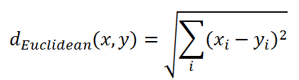
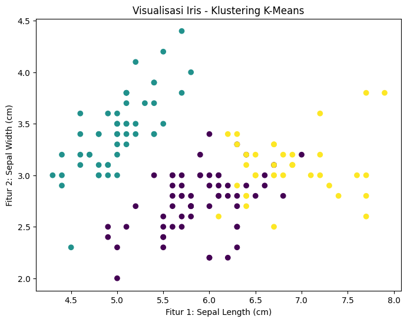

# Clustering dalam Machine Learning

## Apa itu Clustering?
**Klustering** adalah salah satu teknik dalam machine learning yang digunakan untuk mengelompokkan data berdasarkan kesamaan atau karakteristik fitur-fitur yang dimilikinya. Dalam klustering, tidak ada label yang diberikan pada data sehingga algoritma ini termasuk dalam kategori unsupervised learning. Tujuan dari klustering adalah untuk memisahkan data ke dalam beberapa kelompok atau kluster di mana data dalam satu kluster memiliki kemiripan yang lebih tinggi satu sama lain dibandingkan dengan data di kluster lain.

Klustering digunakan dalam berbagai aplikasi, mulai dari segmentasi pasar, analisis citra, deteksi anomali, hingga pengelompokan dokumen. Salah satu algoritma klustering yang paling populer adalah **K-Means** yang digunakan untuk membagi data ke dalam sejumlah kluster yang ditentukan sebelumnya.

## Tipe-Tipe Algoritma Clustering

### 1. K-Means
**K-Means** adalah algoritma klustering yang bertujuan untuk membagi data ke dalam K kluster berdasarkan karakteristik atau kemiripan fitur. Algoritma ini mencari titik pusat (centroid) dari setiap kluster dan mengelompokkan data ke dalam kluster yang memiliki pusat terdekat.

**Prinsip Kerja K-Means**
- Tentukan jumlah kluster (K) yang diinginkan.
- Pilih K titik acak sebagai centroid awal.
- Setiap titik data akan dikelompokkan ke dalam kluster yang centroid-nya paling dekat.
- Setelah data dikelompokkan, centroid untuk masing-masing kluster dihitung ulang dengan mengambil rata-rata dari semua titik dalam kluster tersebut.
- Langkah 3 dan 4 diulang hingga konvergensi tercapai, yaitu ketika posisi centroid tidak berubah lagi.

**Formula Jarak**
Untuk mengukur kedekatan antara titik data dengan centroid, K-Means menggunakan metrik jarak, yang umumnya adalah Euclidean distance. Formula Euclidean distance antara dua titik 
`P = (p1, p2, ..., pn)` dan `Q = (q1, q2, ..., qn)` dalam ruang n-dimensional adalah:



**Keunggulan K-Means**
- K-Means adalah algoritma yang sederhana dan mudah dipahami.
- K-Means sangat efisien untuk dataset besar karena memiliki kompleksitas waktu yang relatif rendah, yaitu O(n * k * t), di mana n adalah jumlah titik data, k adalah jumlah kluster, dan t adalah jumlah iterasi.
- K-Means dapat diterapkan pada berbagai jenis data dan digunakan untuk klustering berbasis fitur numerik.
- K-Means bekerja baik untuk dataset yang memiliki bentuk kluster yang bulat atau globular, di mana setiap kluster dapat dipisahkan dengan jelas.

**Kelemahan K-Means**
- Salah satu kelemahan utama K-Means adalah pemilihan jumlah kluster (K) yang tepat. Jika K terlalu kecil, model akan kehilangan informasi. Jika K terlalu besar, model akan terlalu terfragmentasi.
- Pemilihan centroid awal secara acak dapat mempengaruhi hasil klustering, karena bisa saja kluster terdistorsi jika titik awal tidak dipilih dengan baik.
- K-Means cenderung buruk dalam menangani kluster yang memiliki bentuk non-bulat, seperti kluster yang memanjang atau berliku-liku.
- Outliers dapat sangat mempengaruhi posisi centroid dan hasil klustering secara keseluruhan.

**Evaluasi Model K-Means**
Evaluasi klustering dapat dilakukan dengan menggunakan metrik berikut:
- **Inertia (Sum of Squared Errors)**: Mengukur seberapa baik data dikelompokkan. Inertia adalah jumlah kuadrat jarak antara titik data dan centroid kluster terdekat. Semakin rendah nilai inertia, semakin baik klustering tersebut.
- **Silhouette Score**: Mengukur sejauh mana setiap titik berada dalam kluster yang benar-benar sesuai. Nilai silhouette yang lebih tinggi menunjukkan kluster yang lebih baik dan lebih terpisah.
- **Davies-Bouldin Index**: Mengukur rasio antara jarak antar kluster dengan jarak dalam kluster. Nilai yang lebih rendah menunjukkan hasil klustering yang lebih baik.

**Implementasi K-Means dalam Kode Python** 
```python
# Import library yang dibutuhkan
import numpy as np
import pandas as pd
from sklearn.datasets import load_iris
from sklearn.cluster import KMeans
from sklearn.metrics import silhouette_score
import matplotlib.pyplot as plt

# Memuat dataset Iris
data = load_iris()
X = data.data  # Fitur (panjang dan lebar kelopak, panjang dan lebar kelopak bunga)

# Membagi data menjadi data latih (80%) dan data uji (20%)
# Kita tidak akan memerlukan pembagian train-test untuk klustering, karena klustering tidak membutuhkan data uji yang terpisah
X_train = X

# Membuat model K-Means dengan K=3 (karena ada 3 jenis bunga dalam dataset ini)
model = KMeans(n_clusters=3, random_state=42)

# Melatih model dengan data
model.fit(X_train)

# Mengambil prediksi kluster untuk data
y_pred = model.predict(X_train)

# Evaluasi model dengan silhouette score
sil_score = silhouette_score(X_train, y_pred)

# Output hasil evaluasi model
print(f"Silhouette Score: {sil_score:.2f}")

# Visualisasi hasil klustering dengan fitur pertama dan kedua
plt.figure(figsize=(8, 6))
plt.scatter(X_train[:, 0], X_train[:, 1], c=y_pred, cmap='viridis', marker='o')
plt.title('Visualisasi Iris - Klustering K-Means')
plt.xlabel('Fitur 1: Sepal Length (cm)')
plt.ylabel('Fitur 2: Sepal Width (cm)')
plt.show()
```

Kode di atas menghasilkan grafik hasil klustering yang terbentuk sebagai berikut:
