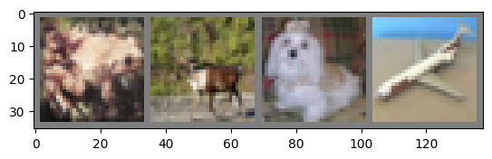
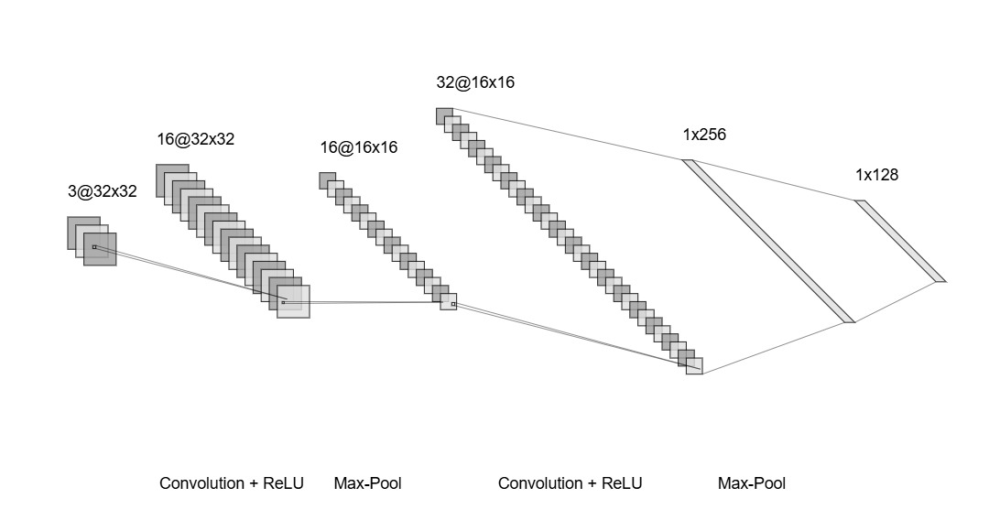

# Deep Learning

## Pendahuluan
Deep Learning adalah salah satu cabang dari machine learning yang memiliki kemampuan luar biasa untuk memproses data yang sangat kompleks dengan menggunakan jaringan saraf tiruan *(neural network)* yang terdiri dari banyak lapisan. Salah satu penerapan utama deep learning adalah *image processing*, yaitu mengajarkan komputer untuk mengenali dan memahami gambar.

Dalam praktikum ini, kita akan mendalami konsep dan implementasi *image processing* menggunakan **PyTorch**, sebuah library populer dalam pengembangan model deep learning. Studi kasus ini akan menggunakan dataset **CIFAR-10** untuk melatih dan menguji model klasifikasi gambar.

## Apa Itu Deep Learning?

### Definisi
Deep Learning adalah salah satu cabang dari machine learning yang memiliki kemampuan luar biasa untuk memproses data yang sangat kompleks dengan menggunakan jaringan saraf tiruan *(neural network)* yang terdiri dari banyak lapisan. Berbeda dengan metode machine learning tradisional, deep learning secara otomatis dapat melakukan proses ekstraksi fitur (*feature extraction*) tanpa perlu desain manual, membuatnya sangat cocok untuk memproses data yang kompleks seperti gambar, suara, dan teks.

### Perbedaan dengan Machine Learning Tradisional
| **Aspek**              | **Machine Learning Tradisional**                               | **Deep Learning**                               |
|-------------------------|---------------------------------------------------------------|------------------------------------------------|
| **Ekstraksi Fitur**    | Dilakukan secara manual oleh manusia                           | Dilakukan secara otomatis oleh jaringan saraf  |
| **Kompleksitas Data**  | Cocok untuk data yang lebih sederhana dan terstruktur          | Mampu menangani data yang tidak terstruktur seperti gambar dan teks |
| **Kebutuhan Data**     | Membutuhkan data yang lebih sedikit                            | Membutuhkan data dalam jumlah besar untuk pelatihan |
| **Kinerja**            | Kurang efektif untuk data berukuran besar                     | Sangat efektif untuk data berukuran besar      |

### Contoh Penggunaan Deep Learning
1. **Klasifikasi Gambar**: Mengenali objek dalam foto atau video (misalnya, deteksi wajah atau kendaraan).
2. **Natural Language Processing (NLP)**: Menganalisis teks seperti terjemahan bahasa, chatbot, atau analisis sentimen.
3. **Speech Recognition**: Konversi suara ke teks, seperti pada aplikasi asisten virtual.
4. **Deteksi Penipuan**: Menganalisis pola transaksi untuk mendeteksi aktivitas yang mencurigakan.
5. **Autonomous Vehicle**: Membantu mobil mengidentifikasi lingkungan sekitar melalui kamera dan sensor.

## Arsitektur Neural Network dalam Deep Learning

Arsitektur jaringan saraf dalam deep learning terdiri dari beberapa jenis layer yang digunakan untuk memproses data, seperti input layer, hidden layer, dan output layer. Salah satu jenis arsitektur yang sering digunakan adalah **Convolutional Neural Network (CNN)**.

### Gambar Ilustrasi Arsitektur Jaringan Saraf

Source: https://medium.com/@samuelsena/pengenalan-deep-learning-part-7-convolutional-neural-network-cnn-b003b477dc94

**Convolutional Neural Network (CNN)** adalah jenis arsitektur jaringan saraf tiruan yang dirancang khusus untuk memproses data berbentuk grid, seperti gambar. CNN memiliki beberapa komponen utama yang bekerja secara hierarkis untuk mengekstraksi fitur dari data input dan melakukan klasifikasi.

### Komponen Utama CNN
1. **Convolutional Layer**
   - Mengekstraksi fitur dasar seperti tepi, sudut, dan tekstur
   - Menggunakan filter (kernel) untuk menghasilkan peta fitur (feature map)

2. **Activation Function**
   - Memperkenalkan non-linearitas, biasanya menggunakan fungsi ReLU
   - Mengubah nilai negatif menjadi nol, sementara nilai positif tetap

3. **Pooling Layer**
   - Mengurangi dimensi peta fitur untuk mempercepat komputasi
   - Contoh: Max pooling yang mengambil nilai maksimum dari area kecil

4. **Fully Connected Layer**
   - Menggabungkan fitur-fitur yang telah diekstraksi
   - Melakukan tugas klasifikasi berdasarkan fitur tersebut

5. **Output Layer**
   - Menghasilkan prediksi akhir, seperti probabilitas untuk setiap kelas
   - Fungsi aktivasi softmax sering digunakan untuk tugas klasifikasi

---

# Studi Kasus Deep Learning: Image Processing dengan PyTorch

## Pendahuluan
Deep Learning merupakan bagian dari machine learning yang menggunakan jaringan saraf tiruan dengan banyak lapisan untuk memproses data kompleks. Salah satu penerapan Deep Learning yang populer adalah *image processing*, di mana kita mengajarkan model untuk mengenali gambar. Dalam praktikum ini, kita akan mempelajari bagaimana mengimplementasikan *image processing* menggunakan Neural Network seperti Artificial Neural Network (ANN) atau Convolutional Neural Network (CNN). Library yang digunakan adalah **PyTorch** sebagai salah satu library populer dalam komunitas deep learning karena fleksibilitas dan performanya.

Studi kasus ini bertujuan untuk mengenalkan konsep dasar deep learning, khususnya dalam pemrosesan data berbentuk citra untuk klasifikasi gambar. Praktikum ini akan menggunakan dataset CIFAR-10 untuk pelatihan dan pengujian model. Model ini akan dibangun menggunakan PyTorch dan mengevaluasi performanya melalui akurasi klasifikasi pada dataset gambar.

## Tujuan
- Mengenal konsep dasar Deep Learning dan aplikasinya dalam studi kasus *image processing*
- Mengimplementasikan **Convolutional Neural Network (CNN)** menggunakan PyTorch
- Memahami proses pelatihan, evaluasi, dan analisis performa model dalam masalah klasifikasi gambar

## Persiapan Lingkungan
### Instalasi Library yang dibutuhkan
Praktikum ini memerlukan beberapa library yang akan membantu dalam membangun dan melatih model deep learning. **PyTorch** akan digunakan untuk membangun model, sedangkan **torchvision** digunakan untuk mengelola dataset.

Instal library yang diperlukan dengan perintah berikut:

```bash
pip install torch torchvision
```

### Import Library
Setelah menginstal library, langkah selanjutnya adalah melakukan import beberapa library yang akan digunakan.

```python
import torch
import torch.nn as nn
import torch.optim as optim
import torchvision
import torchvision.transforms as transforms
import matplotlib.pyplot as plt
import torch.nn.functional as F
import numpy as np
```

## Dataset
Dalam praktikum ini, dataset yang akan digunakan adalah **CIFAR-10** sebagai sebuah dataset populer yang berisi 60.000 gambar berwarna yang terbagi menjadi 50.000 gambar untuk data pelatihan dan 10.000 gambar untuk data pengujian. Gambar-gambar dalam dataset ini dibagi menjadi 10 kelas yang berbeda. Setiap gambar dalam dataset ini berukuran 32x32 piksel. Setiap kelas memiliki jumlah gambar yang merata, yaitu masing-masing 6.000 gambar. Dataset ini mencakup berbagai variasi kondisi pencahayaan, orientasi, dan latar belakang yang membuatnya menantang bagi model deep learning untuk mengenali pola dan fitur yang relevan. Hal ini juga menjadikan CIFAR-10 sebagai dataset yang ideal untuk eksperimen pembelajaran mendalam karena kesederhanaannya namun tetap menawarkan kompleksitas yang cukup.

### Load Dataset
Modul `torchvision` digunakan untuk mengunduh dan memuat dataset CIFAR-10. Dataset ini dibagi menjadi data training dan data testing, di mana data training digunakan untuk melatih model dan data testing digunakan untuk mengukur performa model.

```python
# Transformasi untuk data preprocessing
transform = transforms.Compose([
    transforms.ToTensor(),
    transforms.Normalize((0.5, 0.5, 0.5), (0.5, 0.5, 0.5))  # Normalisasi agar distribusi data lebih stabil
])

# Download dan load data training dan testing
trainset = torchvision.datasets.CIFAR10(root='./data', train=True, download=True, transform=transform)
trainloader = torch.utils.data.DataLoader(trainset, batch_size=4, shuffle=True, num_workers=2)

testset = torchvision.datasets.CIFAR10(root='./data', train=False, download=True, transform=transform)
testloader = torch.utils.data.DataLoader(testset, batch_size=4, shuffle=False, num_workers=2)

classes = ('plane', 'car', 'bird', 'cat', 'deer', 'dog', 'frog', 'horse', 'ship', 'truck')
```

## Visualisasi Data
Sebelum memulai proses pelatihan, penting untuk memahami seperti apa data yang kita gunakan. Kita akan melakukan visualisasi beberapa gambar dari dataset menggunakan fungsi `imshow` untuk melihat data yang akan diproses oleh model.

```python
# Fungsi untuk menampilkan gambar
import numpy as np

def imshow(img):
    img = img / 2 + 0.5  # Unnormalize data untuk mengembalikannya ke skala asli
    npimg = img.numpy()
    plt.imshow(np.transpose(npimg, (1, 2, 0)))
    plt.show()

# Menampilkan beberapa gambar dari data training
dataiter = iter(trainloader)
images, labels = next(dataiter)

# Menampilkan gambar
imshow(torchvision.utils.make_grid(images))
# Menampilkan label dari gambar yang diambil
print(' '.join(f'{classes[labels[j]]}' for j in range(4)))
```

Berikut tampilan beberapa gambar dari dataset CIFAR-10:


## Definisi Arsitektur CNN
Convolutional Neural Network (CNN) adalah tipe jaringan saraf yang sangat efisien untuk menangani data citra. CNN terdiri dari layer konvolusi yang berfungsi untuk mendeteksi fitur visual, seperti tepi, tekstur, atau objek yang lebih kompleks. Berikut ini adalah definisi arsitektur CNN sederhana menggunakan PyTorch:

```python
class SimpleCNN(nn.Module):
    def __init__(self):
        super(SimpleCNN, self).__init__()
        # Layer konvolusi pertama, input channel = 3 (RGB), output channel = 16
        self.conv1 = nn.Conv2d(3, 16, 3, padding=1)  # Konvolusi 3x3 dengan padding agar ukuran tetap
        # Layer pooling untuk mengurangi dimensi (downsampling)
        self.pool = nn.MaxPool2d(2, 2)
        # Layer konvolusi kedua, output channel = 32
        self.conv2 = nn.Conv2d(16, 32, 3, padding=1)
        # Fully connected layer pertama
        self.fc1 = nn.Linear(32 * 8 * 8, 128)
        # Fully connected layer kedua
        self.fc2 = nn.Linear(128, 10)  # Output 10 kelas

    def forward(self, x):
        x = self.pool(F.relu(self.conv1(x)))  # Konvolusi -> ReLU -> Pooling
        x = self.pool(F.relu(self.conv2(x)))  # Konvolusi -> ReLU -> Pooling
        x = x.view(-1, 32 * 8 * 8)  # Flattening untuk masuk ke fully connected layer
        x = F.relu(self.fc1(x))  # Fully connected layer -> ReLU
        x = self.fc2(x)  # Output layer
        return x

net = SimpleCNN()
```
Berikut tampilan arsitektur CNN dari kode di atas:


## Loss Function dan Optimizer
Loss Function digunakan untuk mengukur seberapa baik prediksi model terhadap label yang benar. Dalam kasus klasifikasi seperti ini, kita menggunakan **CrossEntropyLoss**. Selain itu, kita menggunakan **Stochastic Gradient Descent (SGD)** sebagai optimizer yang bertugas untuk memperbarui bobot model berdasarkan nilai gradien.

```python
criterion = nn.CrossEntropyLoss()  # Fungsi loss untuk klasifikasi multi-kelas
optimizer = optim.SGD(net.parameters(), lr=0.001, momentum=0.9)  # Optimizer SGD
```

## Pelatihan Model
Pelatihan model dilakukan dengan melakukan forward pass dan backward pass untuk menghitung dan memperbarui bobot berdasarkan error yang dihasilkan. Berikut adalah implementasi pelatihan model:

```python
for epoch in range(2):  # Loop melalui dataset sebanyak 2 kali untuk pelatihan
    running_loss = 0.0
    for i, data in enumerate(trainloader, 0):
        # Input dalam bentuk data adalah list [inputs, labels]
        inputs, labels = data

        # Zero grad parameter gradients
        optimizer.zero_grad()

        # Forward + backward + optimize
        outputs = net(inputs)  # Forward pass
        loss = criterion(outputs, labels)  # Hitung loss
        loss.backward()  # Backward pass untuk menghitung gradien
        optimizer.step()  # Optimasi (perbarui bobot)

        # Print statistik loss setiap 2000 mini-batch
        running_loss += loss.item()
        if i % 2000 == 1999:    # Print setiap 2000 mini-batch
            print(f'[{epoch + 1}, {i + 1}] loss: {running_loss / 2000:.3f}')
            running_loss = 0.0

print('Finished Training')
```

## Evaluasi Model
Setelah model dilatih, penting untuk mengevaluasi performanya menggunakan data testing. Akurasi dihitung berdasarkan seberapa banyak prediksi model yang sesuai dengan label asli dari gambar testing.

```python
correct = 0
total = 0
with torch.no_grad():  # Tidak perlu menghitung gradien saat evaluasi
    for data in testloader:
        images, labels = data
        outputs = net(images)
        _, predicted = torch.max(outputs, 1)  # Prediksi label dengan nilai probabilitas tertinggi
        total += labels.size(0)
        correct += (predicted == labels).sum().item()

print(f'Accuracy of the network on the 10000 test images: {100 * correct / total:.2f} %')
```

## Analisis Performa Model
Selain akurasi secara keseluruhan, kita juga perlu melihat performa model pada masing-masing kelas. Analisis ini membantu untuk mengidentifikasi kelas mana yang sulit diklasifikasikan oleh model, dan membantu untuk memahami bias model terhadap beberapa kelas tertentu.

```python
class_correct = list(0. for i in range(10))
class_total = list(0. for i in range(10))
with torch.no_grad():
    for data in testloader:
        images, labels = data
        outputs = net(images)
        _, predicted = torch.max(outputs, 1)
        c = (predicted == labels).squeeze()
        for i in range(4):
            label = labels[i]
            class_correct[label] += c[i].item()
            class_total[label] += 1

for i in range(10):
    print(f'Accuracy of {classes[i]} : {100 * class_correct[i] / class_total[i]:.2f} %')
```

## Kesimpulan
Pada praktikum ini, kita telah belajar bagaimana mengimplementasikan *image processing* menggunakan **PyTorch**. Kita telah menggunakan arsitektur **Convolutional Neural Network (CNN)** sederhana untuk mengklasifikasikan gambar dari dataset **CIFAR-10**. CNN ini terdiri dari beberapa layer konvolusi, pooling, dan fully connected layer, yang dilatih menggunakan **Stochastic Gradient Descent (SGD)** dan dievaluasi menggunakan akurasi pada dataset testing.

Deep Learning dan PyTorch memberikan fleksibilitas untuk membangun model yang kompleks dengan cepat. Pemahaman dasar dari arsitektur CNN, pelatihan model, serta evaluasi performa adalah fondasi penting untuk berbagai proyek machine learning yang lebih kompleks.
